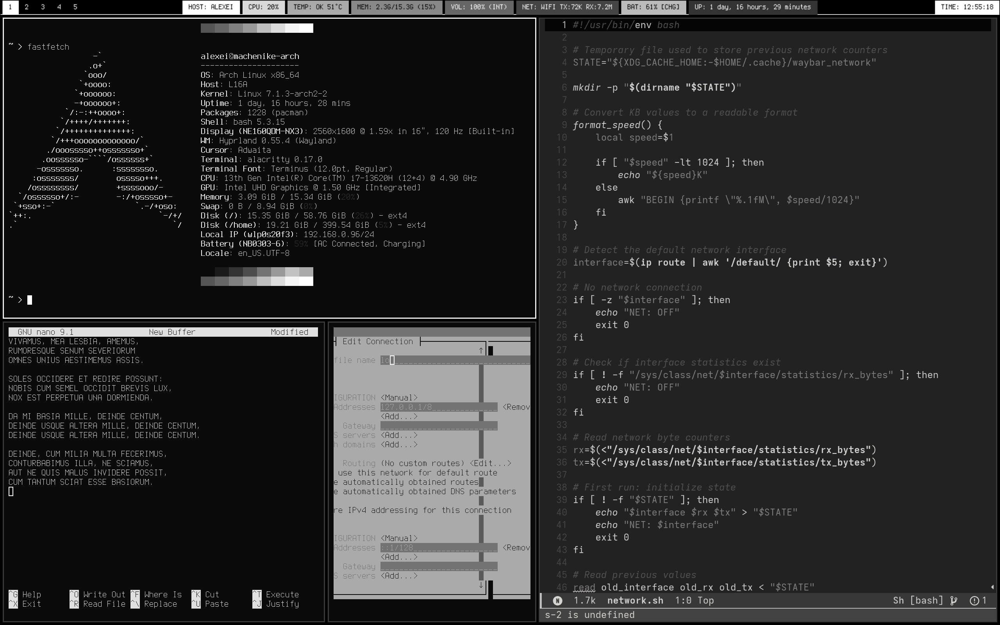

# DOS Hyprland Rice

A Hyprland rice for Arch Linux inspired by **MS-DOS** and **Norton Commander**.

## Design

Built around a deliberately constrained visual language:

* CGA-inspired color palette
* Perfect DOS VGA 437 typography
* Sharp, rectangular UI elements
* No rounded corners
* No blur
* Minimal visual noise

## Status

**In progress**

## Stack

* **WM**: Hyprland
* **Terminal**: Alacritty
* **Bar**: Waybar
* **Launcher**: Wofi
* **File manager**: Thunar
* **Prompt**: Starship

## Structure

* `hypr/` — Hyprland configuration
* `alacritty/` — terminal configuration and themes
* `waybar/` — status bar configuration and scripts
* `wofi/` — application launcher
* `thunar/` — file manager notes
* `wallpapers/` — wallpapers used
* `screenshots/` — screenshots showcasing the result

## Documentation

* [`DESIGN.md`](DESIGN.md) — visual design principles and decisions
* [`SETUP.md`](SETUP.md) — setup and installation instructions

## Installation

> Installation automation is planned. An `install.sh` script will be added in a future update.
